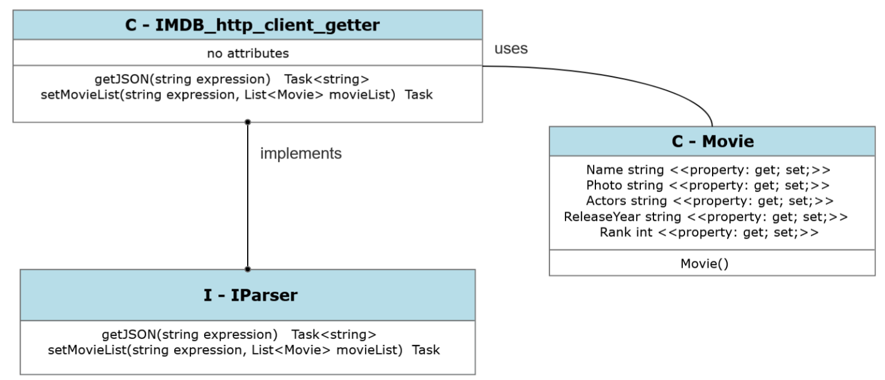
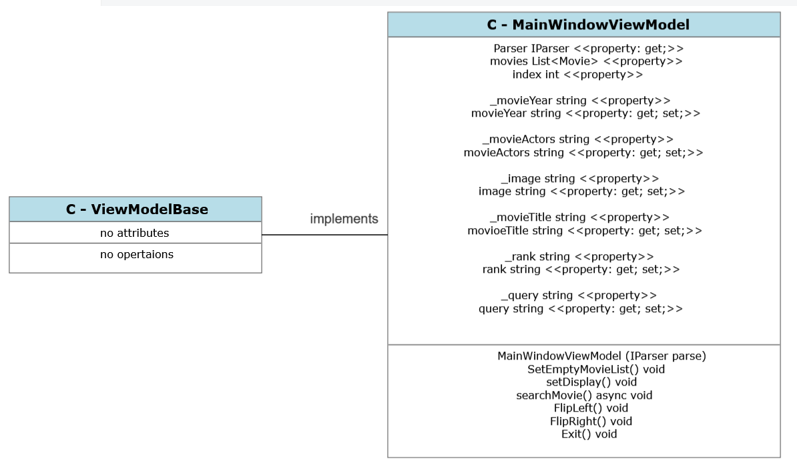
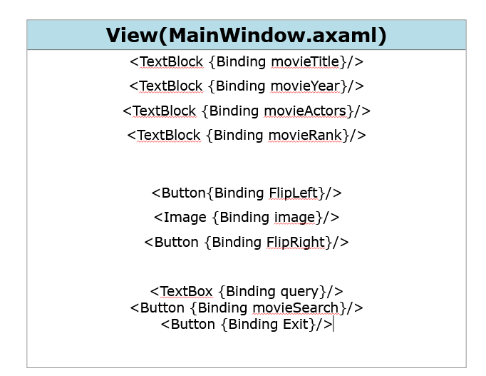
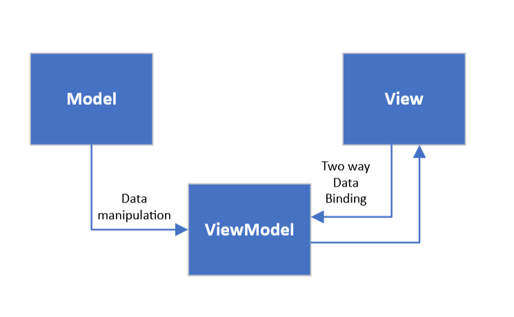

# IMDB_test_api

Members: 

Date: *27* - *06* - *2023*

## Description

This project is the  Final Exam Submision for Real World Interactions at Saxion University

**IMDB_searcher** is a GUI program that uses IMDB's RUST API to **GEt** movies by a given search query, Parses them to a list and displays them individualy on the GUI. 

The framework of our choise is Avalonia UI, due to it being available for development and use across all multiple platforms, includein *Linux*, *Android*, *IOS* *Windows*, etc.  

## Requirements/Dependensies

This program need the following packages to run: 
> `Avalonia` - for obvious reasons
> `AsyncImageLoader`  - for loading images asynchronously from the web.
> `Newtonsoft.Json` - parsing JSON files from the web serve 

**Optional Dependencies:** 
> `System.Windows.Extensions` - playing sound files

## Logic

Avalonia uses the MVVM approach for developing this project. 
MVVM consist of 3 parts: **MODEL** , **VIEWMODEL** and **VIEW**. 
The Following images show the UML Class Diagrams of these parts: 

#### MODEL: 

#### VIEWMODEL: 

#### VIEW: 

These 3 classes when added together make up the structure of our GUI program : 

#### Whole MVVM model: 

